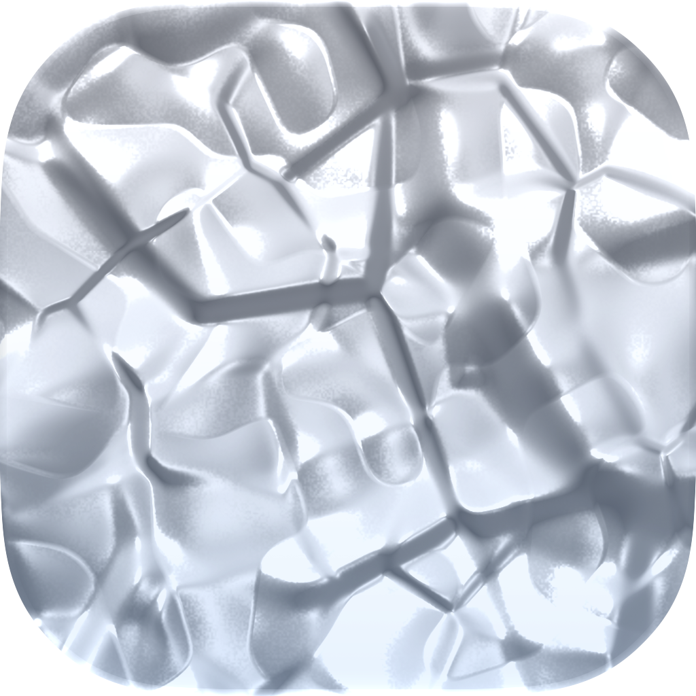
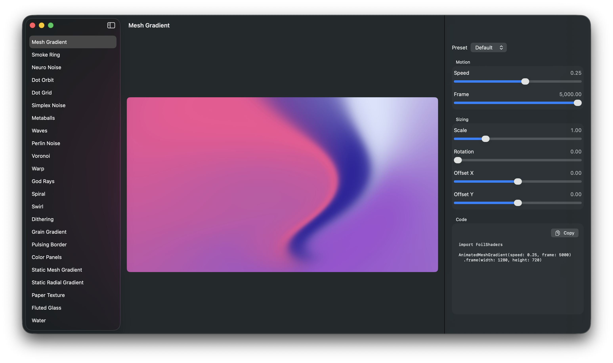

<p align="center">
  
</p>

<h1 align="center">Foil Shaders</h1> 

<p align="center">
  A Metal-based SwiftUI port of <a href="https://github.com/paper-design/shaders">Paper Shaders</a> for iOS and macOS.
</p>

<p align="center">
  <a href="https://github.com/reidbarber/foil-shaders/releases/latest/download/FoilShadersStudio.dmg">
     
  </a>
</p>

<p align="center">
  <a href="https://github.com/reidbarber/foil-shaders/releases/latest/download/FoilShadersStudio.dmg"><b>Download the Foil Shader Studio app</b></a>
</p>

## Install With Xcode

1. Open your app project in Xcode.
2. Choose File > Add Package Dependencies.
3. Enter `https://github.com/reidbarber/foil-shaders.git`.
4. Select version `0.7.0`.
5. Add the `FoilShaders` product to your app target.

For alpha releases, pinning to an exact version is the safest option. If you
want automatic compatible updates, use the standard package rule starting at
`0.7.0`.

## Install With Package.swift

```swift
dependencies: [
  .package(url: "https://github.com/reidbarber/foil-shaders.git", from: "0.7.0")
],
targets: [
  .target(
    name: "YourTarget",
    dependencies: [
      .product(name: "FoilShaders", package: "foil-shaders")
    ]
  )
]
```

## Usage

```swift
import SwiftUI
import FoilShaders

struct ContentView: View {
  var body: some View {
    AnimatedMeshGradient(
      colors: ["#5100ff", "#00ff80", "#ffcc00", "#ea00ff"],
      distortion: 1,
      swirl: 0.8,
      speed: 0.2
    )
    .frame(width: 240, height: 240)
  }
}
```

Most shader components also include the presets from Paper Shaders documentation:

```swift
FoilShaders.Swirl(.candy)
  .frame(width: 240, height: 240)
```

Every shader component also has a flat initializer. Color parameters accept
`ShaderColor` values, including string literals parsed as hex, `rgb()`, or
`hsl()` colors:

```swift
FoilShaders.Dithering(
  colorBack: "#000000",
  colorFront: "hsl(195 100% 50%)",
  shape: .sphere,
  type: .fourByFour,
  speed: 0.2
)
```

Animated SwiftUI components respect the system Reduce Motion setting by default
and pause rendering while inactive or offscreen. Use separate opt-outs when a
subtree should ignore Reduce Motion or continue rendering while hidden:

```swift
AnimatedMeshGradient()
  .foilShadersRespectsReduceMotion(false)
  .foilShadersPausesWhenInactiveOrOffscreen(false)
```

## Agent Skills

Install the `foil-shaders` agent skill by running the following command in your project root:

```bash
npx skills add https://github.com/reidbarber/foil-shaders
```

## Visual Parity

Foil Shaders ports the Paper Shaders APIs, preset metadata, and shader behavior
to Metal. The repository includes a visual parity suite that compares Foil
Shaders output against golden images rendered from the original Paper Shaders
WebGL implementation.

These examples use the same preset, frame, and 320x240 canvas on both sides.

| Shader                    | Paper Shaders                                                                                                           | Foil Shaders                                                                                                          |
| ------------------------- | ----------------------------------------------------------------------------------------------------------------------- | --------------------------------------------------------------------------------------------------------------------- |
| Mesh Gradient / Default   |      |      |
| Swirl / Candy             |                          |                          |
| Dithering / Ripple        |                |                |
| Voronoi / Default         |                  |                  |
| Paper Texture / Cardboard |  |  |

## Status

Alpha, pre-1.0. APIs may change before the first stable release.

## Contributing

Development setup, testing, parity workflow, preset generation, and release
packaging notes live in [CONTRIBUTING.md](CONTRIBUTING.md).

## License

Foil Shaders is licensed under the Apache License, Version 2.0. See
[LICENSE](LICENSE).

Foil Shaders includes Metal ports, API design, presets, and parity references
derived from [Paper Shaders](https://github.com/paper-design/shaders), which is
also licensed under Apache-2.0. See
[THIRD_PARTY_NOTICES.md](THIRD_PARTY_NOTICES.md) for attribution details.
