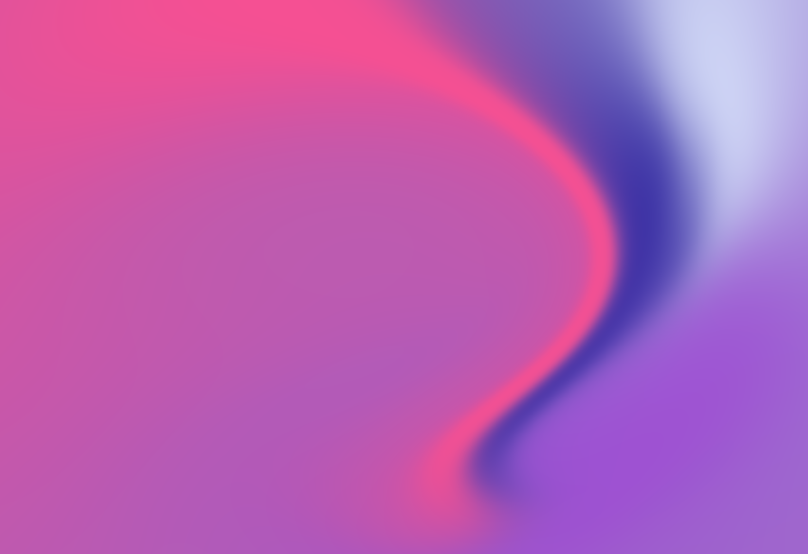
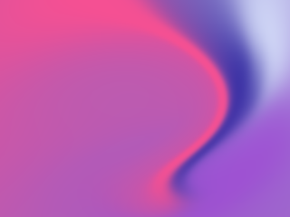
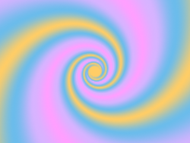
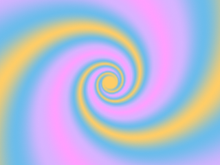
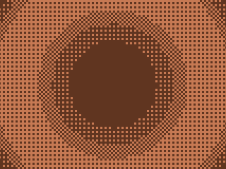
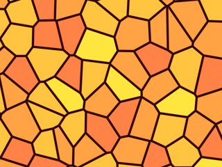
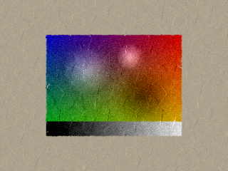
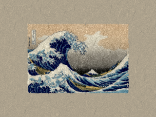

# Foil Shaders

A Metal-based SwiftUI port of
[Paper Shaders](https://github.com/paper-design/shaders) for iOS and macOS.



[Download the Foil Shader Studio app](https://github.com/reidbarber/foil-shaders/releases/latest/download/FoilShadersStudio.dmg) to preview shaders, adjust presets, and copy SwiftUI code.

## Install With Xcode

1. Open your app project in Xcode.
2. Choose File > Add Package Dependencies.
3. Enter `https://github.com/reidbarber/foil-shaders.git`.
4. Select version `0.2.0`.
5. Add the `FoilShaders` product to your app target.

For alpha releases, pinning to an exact version is the safest option. If you
want automatic compatible updates, use the standard package rule starting at
`0.2.0`.

## Install With Package.swift

```swift
dependencies: [
  .package(url: "https://github.com/reidbarber/foil-shaders.git", from: "0.2.0")
],
targets: [
  .target(
    name: "YourTarget",
    dependencies: [
      .product(name: "FoilShaders", package: "foil-shaders")
    ]
  )
]
```

## Usage

```swift
import SwiftUI
import FoilShaders

struct ContentView: View {
  var body: some View {
    FoilShaders.MeshGradient(
      colors: ["#5100ff", "#00ff80", "#ffcc00", "#ea00ff"],
      distortion: 1,
      swirl: 0.8,
      speed: 0.2
    )
    .frame(width: 240, height: 240)
  }
}
```

Most shader components also include the presets from Paper Shaders documentation:

```swift
FoilShaders.Swirl(FoilShaders.Swirl.presets[1])
  .frame(width: 240, height: 240)
```

## Visual Parity

Foil Shaders ports the Paper Shaders APIs, preset metadata, and shader behavior
to Metal. The repository includes a visual parity suite that compares Foil
Shaders output against golden images rendered from the original Paper Shaders
WebGL implementation.

These examples use the same preset, frame, and 320x240 canvas on both sides.

| Shader                    | Paper Shaders                                                                                                           | Foil Shaders                                                                                                          |
| ------------------------- | ----------------------------------------------------------------------------------------------------------------------- | --------------------------------------------------------------------------------------------------------------------- |
| Mesh Gradient / Default   |      |      |
| Swirl / Candy             |                          |                          |
| Dithering / Ripple        |                |                |
| Voronoi / Default         |                  |                  |
| Paper Texture / Cardboard |  |  |

See [CONTRIBUTING.md](CONTRIBUTING.md) for the local parity test and golden
regeneration workflow.

## Status

Alpha, pre-1.0. APIs may change before the first stable release.

## Contributing

Development setup, testing, parity workflow, preset generation, and release
packaging notes live in [CONTRIBUTING.md](CONTRIBUTING.md).

## License

Copyright 2026 Reid Barber.

Foil Shaders is licensed under the Apache License, Version 2.0. See
[LICENSE](LICENSE).

Foil Shaders includes Metal ports, API design, presets, and parity references
derived from [Paper Shaders](https://github.com/paper-design/shaders), which is
also licensed under Apache-2.0. See
[THIRD_PARTY_NOTICES.md](THIRD_PARTY_NOTICES.md) for attribution details.
